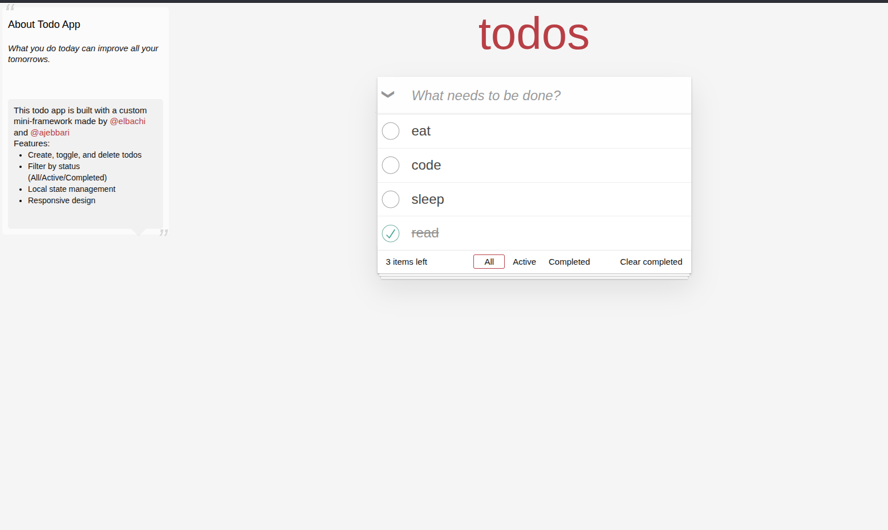

# Mini Framework & Todo App



This project demonstrates a custom built, lightweight JavaScript framework inspired by React, along with a fully functional Todo application built on top of it.

## 🚀 Features

### Mini Framework
A minimal, component-based framework that includes:
- **Virtual DOM**: Efficient DOM updates using a diffing algorithm (`framework/core/diff.js`).
- **Hooks**: React-like hooks implementation:
  - `useState`: For state management.
  - `useEffect`: For side effects and lifecycle events.
- **Router**: Hash-based routing system (`framework/core/router.js`) supporting navigation and parameters.
- **Event Handling**: Simplified event delegation and handling.
- **JSX Support**: Uses custom `jsx` and `createElement` functions for component rendering.

### Todo Application
A complete Todo MVC implementation featuring:
- **CRUD Operations**: Add, edit, delete, and toggle todos.
- **Filtering**: View All, Active, or Completed todos via URL routing.
- **Data Persistence**: Todos are managed in-memory (extensible to local storage).
- **Responsive Design**: Clean and responsive UI using standard CSS.

## 📂 Project Structure

```text
Mini-Framwork/
├── framework/              # The core framework code
│   ├── core/
│   │   ├── diff.js         # Virtual DOM diffing algorithm
│   │   ├── dom.js          # DOM manipulation and JSX transformations
│   │   ├── events.js       # Event handling system
│   │   ├── router.js       # Hash-based router
│   │   └── state.js        # State management (useState, useEffect)
│   └── index.js            # Framework entry point exporting hooks and render
├── todoapp/                # The example Todo application
│   ├── components/         # UI Components (TodoApp, TodoItem, etc.)
│   ├── styles/             # CSS styles
│   ├── utils/              # Helper functions
│   └── app.js              # Application entry point
├── index.html              # Main HTML entry point
└── NOTES.md                # Development notes
```

## 🛠️ Usage

### Running the App
Since this is a client-side application using ES modules, you need to serve it using a local static server to avoid CORS issues with file:// protocol.

1.  **Using Python (Pre-installed on most systems):**
    ```bash
    # Run in the root directory
    python3 -m http.server 8000
    ```
2.  **Using Node.js (http-server):**
    ```bash
    npx http-server .
    ```
3.  Open your browser and navigate to `http://localhost:8000`.

### Developing with the Framework

To create a new component:

```javascript
import { jsx, useState } from './framework/index.js';

function Counter() {
  const [count, setCount] = useState(0);

  return jsx('button', {
    onclick: () => setCount(count + 1)
  }, `Count is: ${count}`);
}
```

## 🧠 Core Concepts

### State Management
The framework uses a global state array with index tracking, similar to how React hooks work under the hood. `useState` returns the current state and a setter function that triggers a re-render.

### Routing
The router listens to `hashchange` events. The `useRouter` hook exposes `route`, `navigate`, and `getParams` to components, allowing them to react to URL changes.

### Virtual DOM & Diffing
The `render` function in `framework/index.js` creates a virtual tree. The `diff` function compares the new tree with the old one and patches the actual DOM, ensuring minimal updates for better performance.

## 📝 Notes
- Ensure your browser supports ES Modules.
- The routing system automatically redirects root (`/`) to `#/all`.
